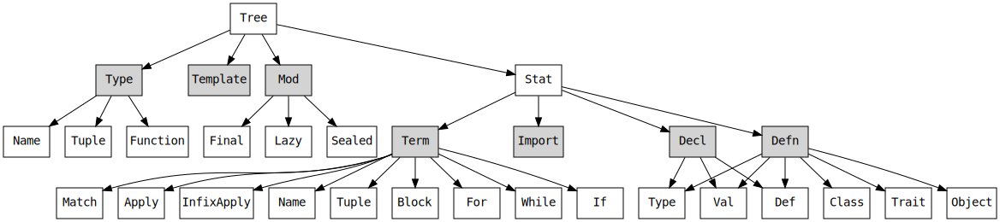

A core functionality of Scalameta is syntax trees, which enable you to read,
analyze, transform and generate Scala programs at a high level of abstraction.
In this guide, you will learn how to

- parse source code into syntax trees
- construct new syntax trees
- pattern match syntax trees
- traverse syntax trees
- transform syntax trees

This guide assumes you have basic knowledge of programming with Scala. Let's get
started!

## Installation

Add a dependency to Scalameta in your build to get started. Scalameta supports
Scala 2.11, Scala 2.12, Scala.js and Scala Native.

### sbt

```scala
// build.sbt
libraryDependencies += "org.scalameta" %% "scalameta" % "4.0.0-M11"

// For Scala.js, Scala Native
libraryDependencies += "org.scalameta" %%% "scalameta" % "4.0.0-M11"
```


[](https://maven-badges.herokuapp.com/maven-central/org.scalameta/scalameta_2.12)

All code examples assume you have the following import

```scala
import scala.meta._
```

### Ammonite REPL

A great way to experiment with Scalameta is to use the
[Ammonite REPL](http://ammonite.io/#Ammonite-REPL).

```scala
// Ammonite REPL
import $ivy.`org.scalameta::scalameta:4.0.0-M11`, scala.meta._
```

### Scastie

You can try out Scalameta online with the [Scastie playground](scastie.md).

## What is a syntax tree?

Syntax trees are a representation of source code that makes it easier to
programmatically analyze programs. Scalameta has syntax trees that represent
Scala programs.



Scalameta trees are **lossless**, meaning that they represent Scala programs in
sufficient details to go from text to trees and vice-versa without significant
loss of details. Lossless syntax trees are great for fine-grained analysis of
source code, which is useful for a range of applications including formatting,
refactoring, linting and documentation tools

## Parse trees

Scalameta comes with a parser to produce syntax trees from Scala source code.
You can parse trees from a variety of sources into different kinds of tree
nodes.

### From strings

The simplest way to parse source code is from a string. As long as you have
`import scala.meta._` in your scope, you can use the `parse[Source]` extension
method

```scala
val program = """object Main extends App { print("Hello!") }"""
val tree = program.parse[Source].get
```

Once parsed, you can print the tree back into its original source code

```scala
println(tree.syntax)
// object Main extends App { print("Hello!") }
```

The problem with parsing from strings it that error messages don't include a
filename

```scala
println(
  "object Main {".parse[Source]
)
// <input>:1: error: } expected but end of file found
// object Main {
//              ^
```

To make error messages more helpful it's recommended to always use virtual files
when possible.

### From files

To parse a file into a tree it's recommended to first read the file contents
into a string and then construct a virtual file

```scala
val path = java.nio.file.Paths.get("docs", "example.scala")
val bytes = java.nio.file.Files.readAllBytes(path)
val text = new String(bytes, "UTF-8")
val input = Input.VirtualFile(path.toString, text)
val exampleTree = input.parse[Source].get
```

```scala
print(exampleTree.syntax)
// object Example extends App { println("Hello from a file!") }
```

The difference between `text.parse[Source]` and `input.parse[Source]` is that
the filename appear in error messages for `Input.VirtualFile`.

```scala
println(
  Input.VirtualFile("example.scala", "object Main {").parse[Source]
)
// example.scala:1: error: } expected but end of file found
// object Main {
//              ^
```

### From expressions

To parse a simple expressions such as `a + b` use `parse[Stat]` The name `Stat`
stands for "statement".

```scala
println("a + b".parse[Stat].get.structure)
// Term.ApplyInfix(Term.Name("a"), Term.Name("+"), List(), List(Term.Name("b")))
```

If we try to parse an expression with `parse[Source]` we get an error because
`a + b` is not valid at the top-level for Scala programs

```scala
println("a + b".parse[Source])
// <input>:1: error: expected class or object definition
// a + b
// ^
```

The same solution can be used to parse other tree nodes such as types

```scala
println("A with B".parse[Type].get.structure)
// Type.With(Type.Name("A"), Type.Name("B"))
```

If we use `parse[Stat]` to parse types we get an error

```scala
println("A with B".parse[Stat])
// <input>:1: error: end of file expected but with found
// A with B
//   ^
```

### From programs with multiple top-level statements

To parse programs with multiple top-level statements such as `build.sbt` files
or Ammonite scripts we use the `Sbt1` dialect. By default, we get an error when
using `parse[Source]`.

```scala
val buildSbt = """
val core = project
val cli = project.dependsOn(core)
"""
```

```scala
println(buildSbt.parse[Source])
// <input>:2: error: expected class or object definition
// val core = project
// ^
```

This error happens because vals are not allowed as top-level statements in
normal Scala programs. To fix this problem, wrap the input with `dialects.Sbt1`

```scala
println(dialects.Sbt1(buildSbt).parse[Source].get.stats)
// List(val core = project, val cli = project.dependsOn(core))
```

The same solution works for virtual files

```scala
println(
  dialects.Sbt1(
    Input.VirtualFile("build.sbt", buildSbt)
  ).parse[Source].get.stats
)
// List(val core = project, val cli = project.dependsOn(core))
```

The difference between `dialects.Sbt1(input)` and `parse[Stat]` is that
`parse[Stat]` does not allow multiple top-level statements

```scala
println(buildSbt.parse[Stat])
// <input>:3: error: end of file expected but val found
// val cli = project.dependsOn(core)
// ^
```

Note that `dialects.Sbt1` does not accept programs with package declarations

```scala
println(
  dialects.Sbt1("package library; object Main").parse[Source]
)
// <input>:1: error: illegal start of definition
// package library; object Main
// ^
```

## Construct trees

Sometimes we need to dynamically construct syntax trees instead of parsing them
from source code. There are two primary ways to construct trees: normal
constructors and quasiquotes.

### With normal constructors

Normal tree constructors as plain functions

```scala
println(Term.Apply(Term.Name("function"), List(Term.Name("argument"))))
// function(argument)
```

Although normal constructors are verbose, they give most flexibility when
constructing trees.

To learn tree node names you can use `.structure` on existing tree nodes

```scala
println("function(argument)".parse[Stat].get.structure)
// Term.Apply(Term.Name("function"), List(Term.Name("argument")))
```

The output of structure is safe to copy-past into programs.

Another good way to learn the structure of trees is
[AST Explorer](http://astexplorer.net/#/gist/ec56167ffafb20cbd8d68f24a37043a9/97da19c8212688ceb232708b67228e3839dadc7c).

### With quasiquotes

Quasiquotes are macro interpolators that expand at compile-time into normal
constructor calls

```scala
println(q"function(argument)".structure)
// Term.Apply(Term.Name("function"), List(Term.Name("argument")))
```

You can write multiline quasiquotes to construct large programs

```scala
println(
  q"""
  object Example extends App {
    println(42)
  }
  """.structure
)
// Defn.Object(
//   List(),
//   Term.Name("Example"),
//   Template(
//     List(),
//     List(Init(Type.Name("App"), Name.Anonymous, List())),
//     Self(Name.Anonymous, None),
//     List(Term.Apply(Term.Name("println"), List(Lit.Int(42))))
//   )
// )
```

> It's important to keep in mind that quasiquotes expand at compile-time into
> the same program as if you had written normal constructors by hand. This means
> for example that formatting details or comments are not preserved

```scala
println(q"function  (    argument   ) // comment")
// function(argument)
```

Quasiquotes can be composed together with dollar splices `..$`

```scala
val arguments = List(q"arg1", q"arg2")
// arguments: List[Term.Name] = List(Term.Name("arg1"), Term.Name("arg2"))

println(q"function(..$arguments)")
// function(arg1, arg2)
```

To construct curried argument lists use triple dot splices `...$`

```scala
val arguments2 = List(q"arg3", q"arg4")
// arguments2: List[Term.Name] = List(Term.Name("arg3"), Term.Name("arg4"))

val allArguments = List(arguments, arguments2)
// allArguments: List[List[Term.Name]] = List(List(Term.Name("arg1"), Term.Name("arg2")), List(Term.Name("arg3"), Term.Name("arg4")))

println(q"function(...$allArguments)")
// function(arg1, arg2)(arg3, arg4)
```

A common mistake is to splice an empty type parameter list into type application
nodes . Imagine we have a list of type arguments that happens to be empty

```scala
val typeArguments = List.empty[Type]
```

If we directly splice the lists into a type application we get a cryptic error
message "invariant failed"

```scala
q"function[..$typeArguments]()"
// org.scalameta.invariants.InvariantFailedException: invariant failed:
// when verifying targs.!=(null).&&(targs.nonEmpty)
// found that targs.nonEmpty is false
// where targs = List()
// 	at org.scalameta.invariants.InvariantFailedException$.raise(Exceptions.scala:15)
// 	at scala.meta.Term$ApplyType$.internal$49(Trees.scala:82)
// 	at scala.meta.Term$ApplyType$.apply(Trees.scala:82)
// 	at repl.Session.$anonfun$app$39(/Users/ollie/dev/scalameta-tutorial/docs/trees.md:195)
```

The quasiquote above is equivalent to calling the normal constructor
`Type.ApplyType(.., typeArguments)`. Scalameta trees perform strict runtime
validation for invariants such as "type application arguments must be
non-empty". To fix this problem, guard the splice against the length of the list

```scala
println(
  (if (typeArguments.isEmpty) q"function()"
   else q"function[..$typeArguments]()").structure
)
// Term.Apply(Term.Name("function"), List())
```

To learn more about quasiquotes, consult the [quasiquote spec](quasiquotes.md).

## Pattern match trees

Use pattern matching to target interesting tree nodes and deconstruct them. A
core design principle of Scalameta trees is that tree pattern matching is the
dual of tree construction. If you know how to construct a tree, you know how to
de-construct it.

### With normal constructors

Normal constructors work in pattern position the same way they work in regular
term position.

```scala
"function(arg1, arg2)".parse[Term].get match {
  case Term.Apply(function, List(arg1, arg2)) =>
    println("1 " + function)
    println("2 " + arg1)
    println("3 " + arg2)
}
// 1 function
// 2 arg1
// 3 arg2
```

Repeated fields are always `List[T]`, so you can safely deconstruct trees with
the `List(arg1, arg2)` syntax or if you prefer the `arg1 :: arg2 :: Nil` syntax.
There is no need to use `Seq(arg1, arg2)` or `arg1 +: arg2 +: Nil`.

### With quasiquotes

Quasiquotes expand at compile-time and work the same way in pattern position as
in term position

```scala
Term.Apply(
  Term.Name("function"),
  List(Term.Name("arg1"), Term.Name("arg2"))
) match {
  case q"$function(..$args)" =>
    println("1 " + function)
    println("2 " + args)
}
// 1 function
// 2 List(arg1, arg2)
```

Use triple dollar splices `...$` to extract curried argument lists

```scala
"function(arg1, arg2)(arg3, arg4)".parse[Term].get match {
  case q"$function(...$args)" =>
    println("1 " + function)
    println("2 " + args)
}
// 1 function
// 2 List(List(arg1, arg2), List(arg3, arg4))
```

## Compare trees for equality

## Traverse trees

### Simple traversals

### Custom traversals

## Transform trees

### Simple transformations

### Custom transformations

<!-- You can parse source code from a string
```scala mdoc:silent
val programString = "a + b"
val tree = programString.parse[Term].get
```
You can also parse source code from a file
```scala mdoc
import java.nio.file._
val programFile = Files.createTempFile("scalameta", "program.scala")
Files.write(programFile, "a + b".getBytes())
val treeFromFile = programFile.parse[Term].get
```
Use `.traverse` to visit every tree node without collecting values, similarly to
`.foreach`
```scala mdoc
tree.traverse {
case node =>
println(s"${node.productPrefix}: $node")
}
```
Use `.collect` to visit every tree node and collect a computed value for
intersting tree nodes
```scala mdoc
tree.collect {
case Term.Name(name) =>
name
}
```
Use `.transform` to change the shape of the tree
```scala mdoc
tree.transform {
case Term.Name(name) =>
Term.Name(name.toUpperCase)
}.toString
```
The methods `traverse`, `collect` and `transform` don't allow you to customize
the recursion of the tree traversal. For more fine-grained control you can
implement custom `Traverser` and `Transformer` instances.
A `Traverser` implements a `Tree => Unit` function
```scala mdoc
new Traverser {
override def apply(tree: Tree): Unit = tree match {
case infix: Term.ApplyInfix =>
println(infix.op)
case _ =>
super.apply(tree)
}
}.apply(tree)
```
A `Transformer` implements a `Tree => Tree` function
```scala mdoc
new Transformer {
override def apply(tree: Tree): Tree = tree match {
case Term.Name(name) =>
Term.Name(name.toUpperCase)
case Term.ApplyInfix(lhs, op, targs, args) =>
Term.ApplyInfix(
this.apply(lhs).asInstanceOf[Term],
op, targs, args
)
case _ =>
super.apply(tree)
}
}.apply(tree).toString
```
Quasiquotes are a simple way to construct tree nodes
```scala mdoc
val quasiquote = q"a + b"
quasiquote.collect { case Term.Name(name) => name }
```
Quasi-quotes expand at compile-time into direct calls to tree constructors. The
quasi-quote above is equivalent to the manually written `Term.Apply(...)`
expression below
```scala mdoc
val noQuasiquote = Term.ApplyInfix(Term.Name("a"), Term.Name("+"), List(), List(Term.Name("b")))
noQuasiquote.toString
```
Trees use reference equality by default. This may seem counter intuitive at -->

